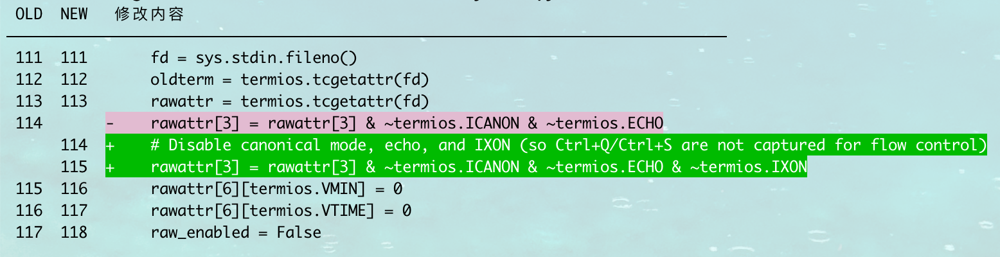
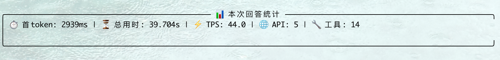
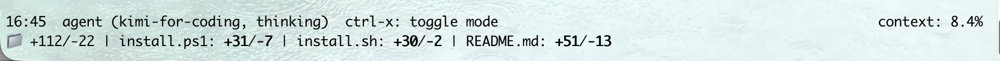
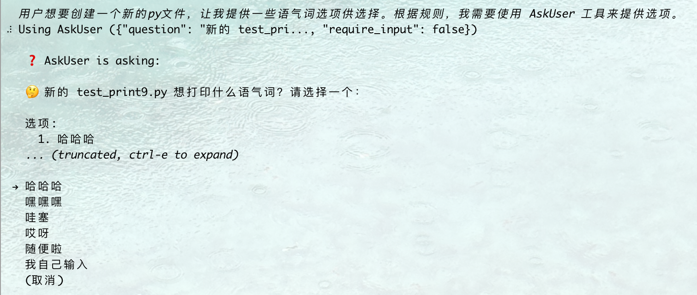

# Kimi CLI Plus (kcp)

[](https://pypi.org/project/kimi-cli-plus/)
[](https://pypistats.org/packages/kimi-cli-plus)

Kimi CLI Plus 是 [Kimi Code CLI](https://github.com/MoonshotAI/kimi-cli) 的魔改版，在保留原版所有功能的基础上，增加了一些实用的新特性。

---

## 📦 安装

### 一键安装

**Linux / macOS:**
```bash
curl -LsSf https://raw.githubusercontent.com/chen-001/kimi-cli-plus/main/scripts/install.sh | bash
```

**Windows (PowerShell):**
```powershell
Invoke-RestMethod https://raw.githubusercontent.com/chen-001/kimi-cli-plus/main/scripts/install.ps1 | Invoke-Expression
```

### 使用 uv 安装

如果你已经安装了 [uv](https://github.com/astral-sh/uv)：

```bash
uv tool install --python 3.13 kimi-cli-plus
```

### 验证安装

```bash
kcp --version
```

---

## 🔄 升级与卸载

**升级：**
```bash
uv tool upgrade kimi-cli-plus --no-cache
```

**卸载：**
```bash
uv tool uninstall kimi-cli-plus
```

---

## ✨ 新增功能

### 1. Diff View 代码对比视图

修改代码时自动显示 Diff 视图，清晰展示新旧代码对比。使用 `Ctrl+Q` 快捷键可切换是否启用 Diff View。



---

### 2. 本次回答统计

每次回答结束后显示详细统计信息：
- ⏱️ **首 token 延迟**: 从发送请求到收到首个 token 的时间
- ⏳ **总用时**: 本次回答的总耗时
- ⚡ **TPS**: Token 每秒生成速度
- 🌐 **API**: 调用 API 的次数
- 🔧 **工具**: 调用工具的次数



---

### 3. Session 行数统计

底部状态栏实时显示当前 Session 累积修改各个文件的行数统计，格式为 `+新增/-删除`，让你一目了然地了解本次会话的代码改动量。



---

### 4. AskUser 交互式选择

当需要用户做选择时，AI 可以直接提供选项列表供用户选择。即使在 YOLO 模式下，也可以使用方向键快速选择，无需手动输入。



---

## 📝 使用说明

安装完成后，可以使用以下命令启动：

```bash
kcp              # 快捷命令
kimi-plus        # 完整命令
kimi-cli-plus    # 替代命令
```

其他使用方式与原版 Kimi Code CLI 完全一致。

---

## 📄 License

本项目基于原版 [Kimi Code CLI](https://github.com/MoonshotAI/kimi-cli) 修改，遵循原项目的开源协议。
